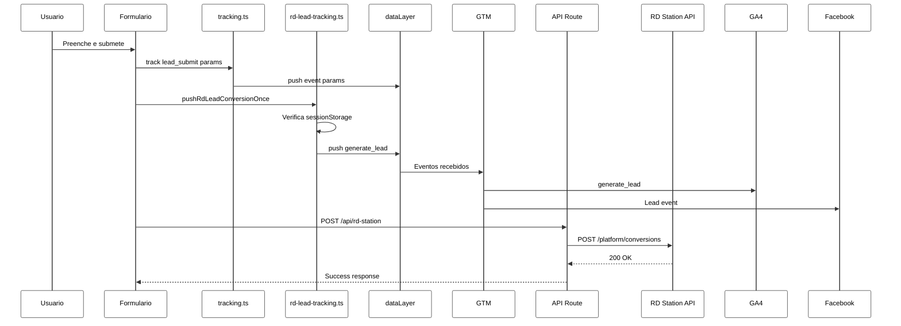

# Documentação de Tracking - MOTIN FILMS

## Visão Geral

Este documento detalha todos os sistemas de tracking implementados no site MOTIN Films.

---

## Diagrama de Arquitetura

```mermaid
%%{init: {'theme': 'base', 'themeVariables': { 'primaryColor': '#ffffff', 'primaryTextColor': '#000000', 'primaryBorderColor': '#333333', 'lineColor': '#333333', 'secondaryColor': '#f0f0f0', 'tertiaryColor': '#e0e0e0'}}}%%
flowchart TB
    subgraph USER["USUARIO"]
        PageView["Visualizacao de Pagina"]
        FormSubmit["Submissao de Formulario"]
        WhatsAppClick["Clique WhatsApp"]
    end

    subgraph LAYOUT["LAYOUT PRINCIPAL"]
        layout["app/layout.tsx"]
        GTMScript["GTM Script - GTM-MMXG7WK"]
        VercelAnalytics["@vercel/analytics"]
    end

    subgraph COMPONENTS["COMPONENTES"]
        subgraph RDComponents["RD Station Components"]
            RDButton["rd-station-button.tsx"]
            RDPopupTracker["rd-station-popup-tracker.tsx"]
            RDConversionListener["rd-popup-conversion-listener.tsx"]
            RDScript["rd-station-script.tsx"]
            RDIntegration["rd-station-integration.tsx"]
            RDForm["rd-station-form.tsx"]
            RDCustomForm["rd-station-custom-form.tsx"]
        end

        subgraph Forms["Formularios"]
            ContactForm["contact-form.tsx"]
            CareersForm["careers-form.tsx"]
        end
    end

    subgraph LIB["BIBLIOTECAS"]
        tracking["lib/tracking.ts"]
        rdStation["lib/rd-station.ts"]
        rdLeadTracking["lib/rd-lead-tracking.ts"]
    end

    subgraph API["API ROUTES"]
        rdStationAPI["api/rd-station/route.ts"]
        careersAPI["api/careers/route.ts"]
    end

    subgraph DATALAYER["DATALAYER"]
        dataLayer["window.dataLayer"]
    end

    subgraph GTM["GOOGLE TAG MANAGER"]
        GTMContainer["GTM-MMXG7WK"]

        subgraph GTMTags["Tags Configuradas"]
            GA4Config["GA4 Config - G-62E37T448N"]
            GA4Event["GA4 Event"]
            GoogleAds["Google Ads - 11108590871"]
            FBPixel["Facebook Pixel - 1008776293617939"]
            ConversionLinker["Conversion Linker"]
        end
    end

    subgraph EXTERNAL["SERVICOS EXTERNOS"]
        GA4["Google Analytics 4"]
        GoogleAdsExt["Google Ads"]
        FacebookExt["Facebook/Meta"]
        RDStationExt["RD Station API"]
        VercelExt["Vercel Analytics"]
    end

    subgraph STORAGE["STORAGE"]
        localStorage["localStorage"]
        sessionStorage["sessionStorage"]
    end

    %% Conexoes do Usuario
    PageView --> layout
    FormSubmit --> Forms
    FormSubmit --> RDComponents
    WhatsAppClick --> RDButton

    %% Layout para GTM
    layout --> GTMScript
    layout --> VercelAnalytics
    GTMScript --> GTMContainer

    %% Componentes para Libs
    RDButton --> rdLeadTracking
    RDButton --> rdStation
    RDPopupTracker --> tracking
    RDConversionListener --> rdLeadTracking
    RDIntegration --> localStorage
    RDForm --> rdStation
    RDCustomForm --> rdStationAPI
    ContactForm --> tracking
    ContactForm --> rdStationAPI
    CareersForm --> tracking
    CareersForm --> careersAPI

    %% Libs para DataLayer/Storage
    tracking --> dataLayer
    tracking --> localStorage
    rdLeadTracking --> dataLayer
    rdLeadTracking --> sessionStorage
    rdStation --> localStorage

    %% DataLayer para GTM
    dataLayer --> GTMContainer

    %% GTM para Tags
    GTMContainer --> GA4Config
    GTMContainer --> GA4Event
    GTMContainer --> GoogleAds
    GTMContainer --> FBPixel
    GTMContainer --> ConversionLinker

    %% Tags para Externos
    GA4Config --> GA4
    GA4Event --> GA4
    GoogleAds --> GoogleAdsExt
    FBPixel --> FacebookExt
    ConversionLinker --> GoogleAdsExt

    %% APIs para Externos
    rdStationAPI --> RDStationExt
    rdStation --> RDStationExt
    VercelAnalytics --> VercelExt
```



---

## Sistemas de Tracking

### 1. Google Tag Manager (GTM)

| Propriedade | Valor |
|-------------|-------|
| **Container ID** | `GTM-MMXG7WK` |
| **Arquivo** | [app/layout.tsx](app/layout.tsx) |
| **Estratégia de Load** | `beforeInteractive` |

**Tags Configuradas no GTM:**
- GA4 Config (`G-62E37T448N`)
- GA4 Event - Send Event
- Google Ads - Page View
- Google Ads - Form Submission
- Facebook Pixel - Page View
- Facebook Pixel - Lead
- Conversion Linker

---

### 2. Google Analytics 4 (GA4)

| Propriedade | Valor |
|-------------|-------|
| **Measurement ID** | `G-62E37T448N` |
| **Integração** | Via GTM + `@next/third-parties` |

**Eventos Rastreados:**
- `page_view`
- `generate_lead`
- `lead_submit`
- `career_application_submit`
- Eventos customizados via dataLayer

---

### 3. RD Station

| Propriedade | Valor |
|-------------|-------|
| **API Endpoint** | `https://api.rd.services/platform/conversions` |
| **Token (Server)** | `RD_STATION_TOKEN` |
| **Token (Client)** | `NEXT_PUBLIC_RD_STATION_TOKEN` |

#### Arquivos Relacionados

| Arquivo | Descrição |
|---------|-----------|
| [lib/rd-station.ts](lib/rd-station.ts) | Classe `RDStationAPI` - envio de conversões |
| [lib/rd-lead-tracking.ts](lib/rd-lead-tracking.ts) | `pushRdLeadConversionOnce()` - tracking deduplicado |
| [app/api/rd-station/route.ts](app/api/rd-station/route.ts) | API Route para conversões |
| [components/rd-station-button.tsx](components/rd-station-button.tsx) | Botão flutuante WhatsApp |
| [components/rd-station-popup-tracker.tsx](components/rd-station-popup-tracker.tsx) | Observer de popups RD |
| [components/rd-popup-conversion-listener.tsx](components/rd-popup-conversion-listener.tsx) | Listener de conversões |
| [components/rd-station-script.tsx](components/rd-station-script.tsx) | Loader do script RD |
| [components/rd-station-integration.tsx](components/rd-station-integration.tsx) | Handler de UTM params |
| [components/rd-station-form.tsx](components/rd-station-form.tsx) | Formulário padrão |
| [components/rd-station-custom-form.tsx](components/rd-station-custom-form.tsx) | Formulário customizado |

---

### 4. Google Ads

| Propriedade | Valor |
|-------------|-------|
| **Conversion ID** | `11108590871` |
| **Conversion Label** | `Q9pzCPbym5UYEJfK_rAp` |
| **Integração** | Via GTM |

**Click IDs Capturados:**
- `gclid` - Google Click ID
- `wbraid` - iOS Web Attribution
- `gbraid` - Android Attribution

---

### 5. Facebook Pixel

| Propriedade | Valor |
|-------------|-------|
| **Pixel ID** | `1008776293617939` |
| **Integração** | Via GTM |

**Eventos:**
- `PageView`
- `Lead`

---

### 6. Vercel Analytics

| Propriedade | Valor |
|-------------|-------|
| **Package** | `@vercel/analytics/next` |
| **Arquivo** | [app/layout.tsx](app/layout.tsx) |

---

## Funções de Tracking

### lib/tracking.ts

```typescript
// Captura IDs de cliques de anúncios (gclid, wbraid, gbraid)
captureAdsClickIds(): void

// Recupera IDs armazenados
getAdsClickIds(): AdsClickIds | null

// Função principal de tracking
track(event: string, params?: object): void

// Tracking com aliases para compatibilidade GTM
trackWithAliases(event: string, aliases: string[], params?: object): void
```

### lib/rd-lead-tracking.ts

```typescript
// Push de conversão de lead (deduplicado por email/sessão)
pushRdLeadConversionOnce(email: string, name?: string, source?: string): void

// Abre popup do RD Station com tracking
openRdStationPopup(source?: string): void

// Extrai dados de formulário e dispara conversão
pushLeadFromForm(form: HTMLFormElement, source?: string): void
```

### lib/rd-station.ts

```typescript
class RDStationAPI {
  // Envia conversão para RD Station
  sendConversion(data: ConversionData): Promise<void>

  // Captura parâmetros UTM da URL
  captureUTMParams(): UTMParams

  // Obtém Client ID do GA
  getGoogleAnalyticsClientId(): string | null
}
```

---

## Eventos Rastreados

| Evento | Aliases | Origem | Destino |
|--------|---------|--------|---------|
| `lead_submit` | - | contact-form.tsx | dataLayer → GTM |
| `career_application_submit` | `join_our_team` | careers-form.tsx | dataLayer → GTM |
| `generate_lead` | - | rd-lead-tracking.ts | dataLayer → GA4 |
| `whatsapp_floating_button_open` | `Initiate WhatsApp` | rd-station-popup-tracker.tsx | dataLayer → GTM |
| `whatsapp_lead_submit` | `Complete WhatsApp`, `complete_whatsapp` | rd-station-popup-tracker.tsx | dataLayer → GTM |
| `sendEvent` | - | rd-lead-tracking.ts | dataLayer → GTM |

---

## Fluxo de Conversão de Lead



---

## Parâmetros UTM

Parâmetros capturados e propagados:

| Parâmetro | Storage Key | Uso |
|-----------|-------------|-----|
| `utm_source` | `utmParams.source` | Origem do tráfego |
| `utm_medium` | `utmParams.medium` | Meio de marketing |
| `utm_campaign` | `utmParams.campaign` | Nome da campanha |
| `utm_term` | `utmParams.term` | Termo de busca |
| `utm_content` | `utmParams.content` | Variante de anúncio |

**Fluxo:**
1. Captura na URL via `rd-station-integration.tsx`
2. Armazena em `localStorage`
3. Injeta em formulários RD Station
4. Enviado para GA4 e Google Ads

---

## Consentimento (LGPD)

| Chave | Valores | Comportamento |
|-------|---------|---------------|
| `cookie-consent` | `accepted` / `declined` | Controla gtag e tracking |

**Eventos sempre permitidos:**
- `consent_update`
- `diagnostic`

**Modo debug:** `localStorage.setItem('debug:tracking', 'true')`

---

## Variáveis de Ambiente

| Variável | Tipo | Descrição |
|----------|------|-----------|
| `RD_STATION_TOKEN` | Server | Token da API RD Station |
| `NEXT_PUBLIC_RD_STATION_TOKEN` | Client | Token público RD Station |
| `NEXT_PUBLIC_DISABLE_LEGACY_TRACKING` | Client | Desabilita eventos alias |
| `NEXT_PUBLIC_GOOGLE_MAPS_API_KEY` | Client | API Key do Google Maps |

---

## Scripts Externos

| Script | Origem | Propósito |
|--------|--------|-----------|
| GTM Loader | `googletagmanager.com/gtm.js` | Container GTM |
| RD Popup | `d335luupugsy2.cloudfront.net/.../rdstation-popup.min.js` | Popups RD Station |
| RD Loader | `d335luupugsy2.cloudfront.net/.../loader.js` | Scripts RD Station |

---

## Arquivos de Configuração GTM

| Arquivo | Descrição |
|---------|-----------|
| [GTM-MMXG7WK_workspace32.json](GTM-MMXG7WK_workspace32.json) | Export do workspace GTM |
| [tag_assistant_motinfilms_com_br_2025_12_11.json](tag_assistant_motinfilms_com_br_2025_12_11.json) | Diagnóstico Tag Assistant |
| [gtm-update-complete-whatsapp.json](gtm-update-complete-whatsapp.json) | Config de tracking WhatsApp |

---

## Types Globais

**Arquivo:** [types/global.d.ts](types/global.d.ts)

```typescript
interface Window {
  gtag: (command: string, action: string, params?: { [key: string]: any }) => void
  RDStationForms: any
  dataLayer: any[]
}
```
